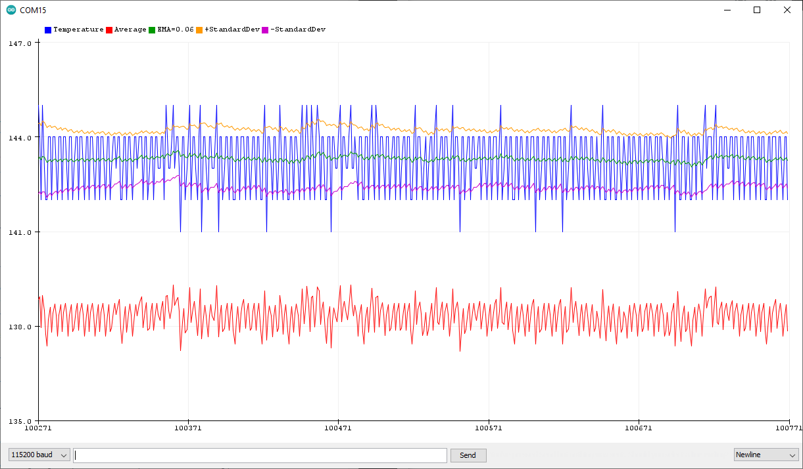

# InternalTempAveraged
Measure internal ADC8 for temperature.  Make two kinds of average. Moving average and exponential moving average

   Author: Forrest Lee Erickson  
   Date: 20220103  
   License: Public domain, Free for all use  
   Warranty: This program is designed to kill you
   and render the earth uninhabitable but is not guaranteed to do so

   Brief: Measure internal ADC8 for temperature. 
   Make two kinds of average. Moving average and exponential moving average

   References:  
   See ATmega48A-PA-88A-PA-168A-PA-328-P-DS-DS40002061B.pdf section 24.8 (page 256)

   Exponentially weighted moving average see:  
   https://en.wikipedia.org/wiki/Exponential_smoothing and
   https://en.wikipedia.org/wiki/Moving_average#Exponentially_weighted_moving_variance_and_standard_deviation

   S0= X0; at t=0
   St = alpha*Xt + (1-alpha)Xt-1 for t > 0

   sigma = Xt -EMAXt-1
   EMVar = )1-alpha)(EMVar-1 + alpha sigma^2)

   User should display data using the Arduino IDE serial plotter feature.
   Note: the two point moving average is offset.

  
  
__Serial plotter screen capture SerialPlotTempEMA.png for alpha equals 1/16.__
